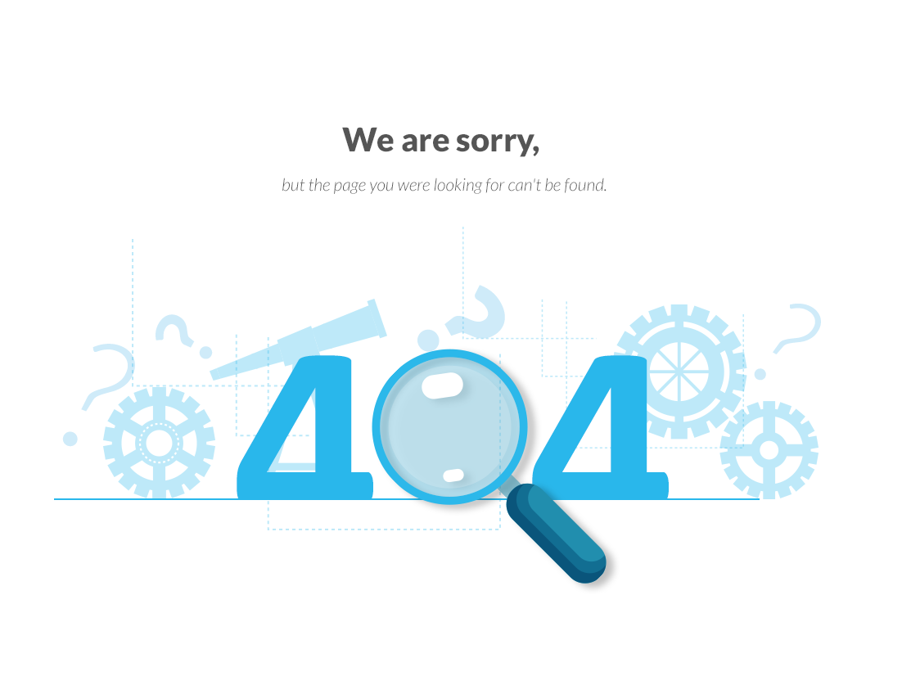

**[공지사항]** [지킬블로그 신규 업데이트 안내 드립니다.](https://www.youtube.com/watch?v=q0P3TSoVNDM&list=PLIMb_GuNnFwfQBZQwD-vCZENL5YLDZekr&index=13)
{: .notice--danger}

<div class="notice--success">
    <b>공지사항입니다.</b>
    <ul>
        <li>공지사항 순서 1</li>
        <li>공지사항 순서 2</li>
    <li>공지사항 순서 3</li>
    </ul>
</div>

[버튼입니다.](https:/google.com){: .btn .btn--danger}





# 첫 포스팅입니다. 설레네요.
오늘 처음 블로그를 만들었습니다. 앞으로 열심히 해보겠습니다.
testing

## 왜 이거 안 나와

```python
class <ClassName>:

    <class_attribute_name> = <value>

    def __init__(self,<param1>, <param2>, ...):
        self.<attr1> = <param1>
        self.<attr2> = <param2>
        .
        .
        .
        # As many attributes as needed
    
   def <method_name>(self, <param1>, ...):
       <code>
       
   # As many methods as needed
   ```

   가운데 정렬입니다.
   {: .text-center}

   오른쪽 정렬입니다.
   {: .text-right}


   이미지 첨부 예시입니다.
   

   {: .img-width-half .align-center}